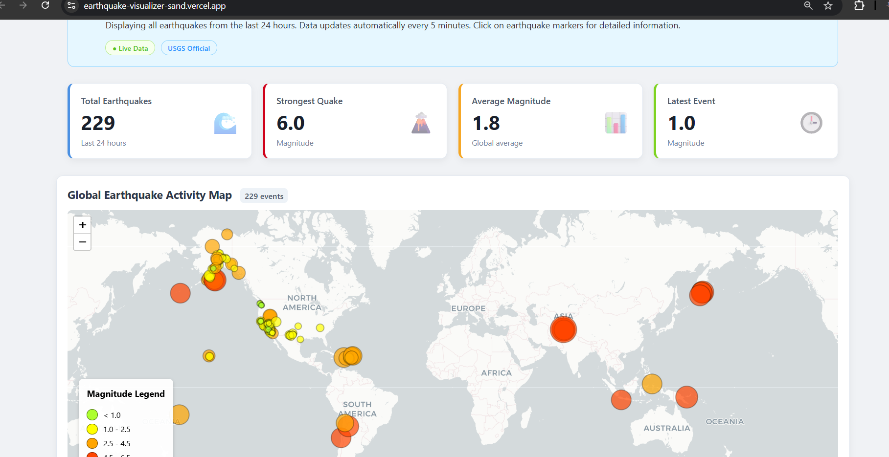

# Global Earthquake Activity Monitor
A web application designed to visualize real-time earthquake data from around the globe.

[View Live Demo](https://earthquake-visualizer-sand.vercel.app/) 👈

## `About The Project`
This project was developed in response to a take home challenge to build a web application for "Casey," a geography student who needs to visualize recent earthquake activity to understand seismic patterns.

The application, Seismo Explorer, fetches and displays the last 24 hours of earthquake data from the USGS. It presents this information in a user-friendly dashboard format, featuring key statistics and an interactive map, allowing users to quickly assess global seismic activity.

## `Core Features`
- Real-time Data: Fetches the latest earthquake data from the official USGS feed.

- Statistics Dashboard: Displays key metrics at a glance:

  - Total number of earthquakes in the last 24 hours.

  - Magnitude of the strongest quake.

  - Average magnitude of all events.

  - Magnitude of the most recent event.

- Interactive Map: Utilizes Leaflet to plot all earthquake events on a global map.

- Data-Driven Visualization:

    - Markers are color-coded based on magnitude for easy identification of significant events.

    - Marker size also scales with magnitude.

- Detailed Information: Clicking on any marker reveals a popup with detailed information, including location, magnitude, depth, and the exact time of the event.

- Responsive Design: The interface is fully responsive and works seamlessly on both desktop and mobile devices.

## `Technology Stack`
This project was built using modern web technologies to create a fast, efficient, and maintainable application.

- Framework: React (with Vite for the build tool)

- Mapping Library: Leaflet & React-Leaflet

- Styling: CSS Modules

- Deployment: Vercel

## `Local Setup and Installation`
To clone and run this project locally, you will need Node.js and npm installed on your machine. Follow these steps:

1. Clone the repository: `git clone` https://github.com/navYadav20/Earthquake-Visualizer.git

2. Navigate to the project directory: `cd Earthquake-Visualizer`

3. Install NPM packages: `npm install`

4. Run the development server: `npm run dev`

    The application will be available at http://localhost:5173.

## `API Used`
This application relies on the free and open Earthquake Catalog API provided by the U.S. Geological Survey (USGS).

- Endpoint Used: [Past Day All Earthquakes](https://earthquake.usgs.gov/earthquakes/feed/v1.0/summary/all_day.geojson)

-------------------------------------------------------------
-------------------------------------------------------------